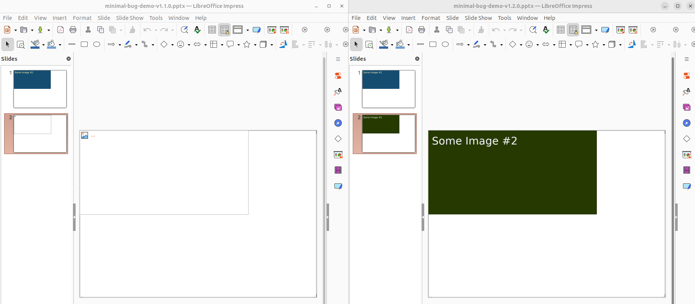

# Bug Demo: Missing media files in PPTX generated by phpoffice/phppresentation version 1.1.0

In PPTX files generated by phpoffice/phppresentation version 1.1.0 with multiple slides, images are broken on the second slide and beyond:

[PPTX generated with version 1.1.0](minimal-bug-demo-v1.1.0.pptx) - Image broken on second slide

Upgrading to version 1.2.0 of phpoffice/phppresentation fixes this bug:

[PPTX generated with version 1.2.0](minimal-bug-demo-v1.2.0.pptx) - Images on all slides visible.

Screenshot comparing second slide with image generated by version 1.1.0 (left hand) and version 1.2.0 (right hand):



## Minmal demo to reproduce the bug

PHP version used:
```
$ php -v
PHP 8.3.6 (cli) (built: Jul 14 2025 18:30:55) (NTS)
Copyright (c) The PHP Group
Zend Engine v4.3.6, Copyright (c) Zend Technologies
    with Zend OPcache v8.3.6, Copyright (c), by Zend Technologies
```

Minimal bug demo PPTX generation using version 1.1.0:
```
$ composer show | grep phppresentation
phpoffice/phppresentation 1.1.0   PHPPresentation - Read, Create and Write Presentations documents in PHP
$ php src/minimal-bug-demo.php 
$ zipinfo tmp/minimal-bug-demo.pptx 
Archive:  tmp/minimal-bug-demo.pptx
Zip file size: 17845 bytes, number of entries: 20
-rw-rw-rw-  6.3 unx     2288 b- defX 25-Aug-20 11:22 [Content_Types].xml
-rw-rw-rw-  6.3 unx     1064 b- defX 25-Aug-20 11:22 docProps/app.xml
-rw-rw-rw-  6.3 unx      875 b- defX 25-Aug-20 11:22 docProps/core.xml
-rw-rw-rw-  6.3 unx      230 b- defX 25-Aug-20 11:22 docProps/custom.xml
-rw-rw-rw-  6.3 unx     9284 b- defX 25-Aug-20 11:22 ppt/media/some-image-11.png
-rw-rw-rw-  6.3 unx      736 b- defX 25-Aug-20 11:22 ppt/presProps.xml
-rw-rw-rw-  6.3 unx     3685 b- defX 25-Aug-20 11:22 ppt/presentation.xml
-rw-rw-rw-  6.3 unx      315 b- defX 25-Aug-20 11:22 ppt/slideLayouts/_rels/slideLayout1.xml.rels
-rw-rw-rw-  6.3 unx      743 b- defX 25-Aug-20 11:22 ppt/slideLayouts/slideLayout1.xml
-rw-rw-rw-  6.3 unx      453 b- defX 25-Aug-20 11:22 ppt/slideMasters/_rels/slideMaster1.xml.rels
-rw-rw-rw-  6.3 unx     1919 b- defX 25-Aug-20 11:22 ppt/slideMasters/slideMaster1.xml
-rw-rw-rw-  6.3 unx      460 b- defX 25-Aug-20 11:22 ppt/slides/_rels/slide1.xml.rels
-rw-rw-rw-  6.3 unx     1376 b- defX 25-Aug-20 11:22 ppt/slides/slide1.xml
-rw-rw-rw-  6.3 unx      460 b- defX 25-Aug-20 11:22 ppt/slides/_rels/slide2.xml.rels
-rw-rw-rw-  6.3 unx     1376 b- defX 25-Aug-20 11:22 ppt/slides/slide2.xml
-rw-rw-rw-  6.3 unx      182 b- defX 25-Aug-20 11:22 ppt/tableStyles.xml
-rw-rw-rw-  6.3 unx    10040 b- defX 25-Aug-20 11:22 ppt/theme/theme1.xml
-rw-rw-rw-  6.3 unx      576 b- defX 25-Aug-20 11:22 ppt/viewProps.xml
-rw-rw-rw-  6.3 unx      753 b- defX 25-Aug-20 11:22 _rels/.rels
-rw-rw-rw-  6.3 unx     1131 b- defX 25-Aug-20 11:22 ppt/_rels/presentation.xml.rels
20 files, 37946 bytes uncompressed, 15317 bytes compressed:  59.6%
```

Minimal bug demo PPTX generation using version 1.2.0:
```
$ sed -i 's/"phpoffice\/phppresentation": "1.1.0"/"phpoffice\/phppresentation": "1.2.0"/' composer.json
$ composer update
$ composer show | grep phppresentation
phpoffice/phppresentation 1.2.0 PHPPresentation - Read, Create and Write Presentations documents in PHP
$ php src/minimal-bug-demo.php 
$ zipinfo tmp/minimal-bug-demo.pptx 
Archive:  tmp/minimal-bug-demo.pptx
Zip file size: 26419 bytes, number of entries: 21
-rw-rw-rw-  6.3 unx     2288 b- defX 25-Aug-20 11:23 [Content_Types].xml
-rw-rw-rw-  6.3 unx     1058 b- defX 25-Aug-20 11:23 docProps/app.xml
-rw-rw-rw-  6.3 unx      875 b- defX 25-Aug-20 11:23 docProps/core.xml
-rw-rw-rw-  6.3 unx      230 b- defX 25-Aug-20 11:23 docProps/custom.xml
-rw-rw-rw-  6.3 unx     9284 b- defX 25-Aug-20 11:23 ppt/media/some-image-11.png
-rw-rw-rw-  6.3 unx    10055 b- defX 25-Aug-20 11:23 ppt/media/some-image-22.png
-rw-rw-rw-  6.3 unx      736 b- defX 25-Aug-20 11:23 ppt/presProps.xml
-rw-rw-rw-  6.3 unx     3685 b- defX 25-Aug-20 11:23 ppt/presentation.xml
-rw-rw-rw-  6.3 unx      315 b- defX 25-Aug-20 11:23 ppt/slideLayouts/_rels/slideLayout1.xml.rels
-rw-rw-rw-  6.3 unx      743 b- defX 25-Aug-20 11:23 ppt/slideLayouts/slideLayout1.xml
-rw-rw-rw-  6.3 unx      453 b- defX 25-Aug-20 11:23 ppt/slideMasters/_rels/slideMaster1.xml.rels
-rw-rw-rw-  6.3 unx     1907 b- defX 25-Aug-20 11:23 ppt/slideMasters/slideMaster1.xml
-rw-rw-rw-  6.3 unx      460 b- defX 25-Aug-20 11:23 ppt/slides/_rels/slide1.xml.rels
-rw-rw-rw-  6.3 unx     1376 b- defX 25-Aug-20 11:23 ppt/slides/slide1.xml
-rw-rw-rw-  6.3 unx      460 b- defX 25-Aug-20 11:23 ppt/slides/_rels/slide2.xml.rels
-rw-rw-rw-  6.3 unx     1376 b- defX 25-Aug-20 11:23 ppt/slides/slide2.xml
-rw-rw-rw-  6.3 unx      182 b- defX 25-Aug-20 11:23 ppt/tableStyles.xml
-rw-rw-rw-  6.3 unx    10044 b- defX 25-Aug-20 11:23 ppt/theme/theme1.xml
-rw-rw-rw-  6.3 unx      576 b- defX 25-Aug-20 11:23 ppt/viewProps.xml
-rw-rw-rw-  6.3 unx      753 b- defX 25-Aug-20 11:23 _rels/.rels
-rw-rw-rw-  6.3 unx     1131 b- defX 25-Aug-20 11:23 ppt/_rels/presentation.xml.rels
21 files, 47987 bytes uncompressed, 23761 bytes compressed:  50.5%
```

## Difference between the generated PPTX files causing the broken image

The broken images in version 1.1.0 are caused by a missing file in ppt/media.

The second slide embeds the image using reference "rId2" in ppt/slides/slide2.xml:
```
<p:blipFill>
    <a:blip r:embed="rId2"/>
    <a:stretch>
    <a:fillRect/>
    </a:stretch>
</p:blipFill>
```

The reference "rId2" resolves to ppt/media/some-image-22.png in ppt/slides/_rels/slide2.xml.rels:
```
<Relationships xmlns="http://schemas.openxmlformats.org/package/2006/relationships">
  <Relationship Id="rId1" Type="http://schemas.openxmlformats.org/officeDocument/2006/relationships/slideLayout" Target="../slideLayouts/slideLayout1.xml"/>
  <Relationship Id="rId2" Type="http://schemas.openxmlformats.org/officeDocument/2006/relationships/image" Target="../media/some-image-22.png"/>
</Relationships>
```

But some-image-22.png does not exist in ppt/media/. Only some-image-11.png for the first slide was put there by phppresentation version 1.1.0.

The PPTX-file generated with version 1.2.0 contains both images in ppt/media as expected:

```
-rw-rw-rw-  6.3 unx     9284 b- defX 25-Aug-20 11:23 ppt/media/some-image-11.png
-rw-rw-rw-  6.3 unx    10055 b- defX 25-Aug-20 11:23 ppt/media/some-image-22.png
```